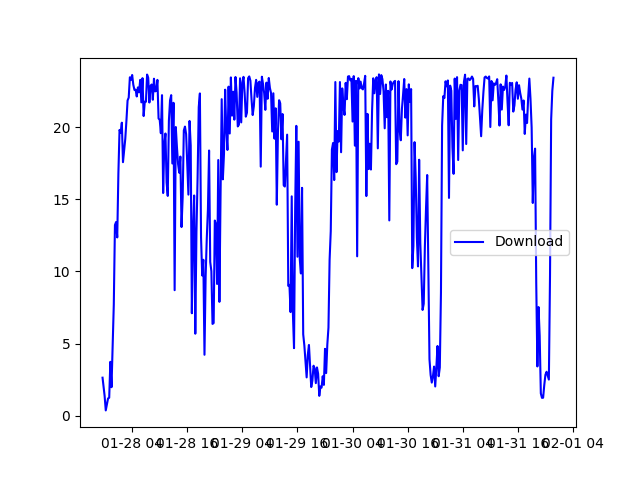

# Speedtest Alexa-Skill and Cronjob

[](https://github.com/philipheimboeck/speedtes/stargazers)
[](https://github.com/philipheimboeck/speedtest/network)
[](https://github.com/philipheimboeck/speedtest/issues)
[](https://twitter.com/intent/tweet?text=https://github.com/philipheimboeck/speedtest)

An easy to use script test the speed (down-, upload and ping) of your ISP regularly (cronjob) and return the results with an Alexa Skill.

##Table of contents

  * [Configuration](#configuration)
  * [Installation](#installation)
  * [Start the Speedtest](#start-the-speedtest)
    * [Plot a Diagramm](#plot-a-diagram)
    * [Import CSV](#import-csv)
    * [Cronjob](#cronjob)
  * [Installation Speedtest Alexa Skill](#installation-speedtest-alexa-skill)
    * [Installation of Flask-Ask and Ngrok](#installation-of-flask-ask-and-ngrok)
    * [Setup Alexa Skill](#setup-alexa-skill)
    * [Start Alexa Skill](#start-alexa-skill) 
  * [Setup Twitter](#setup-twitter)
  * [Contributors](#contributors)

## Configuration

Copy `config.json.dist` to `config.json` and setup the values.

## Installation

* Install pip packages

```
pip install -r requirements.txt
```

* Install python-tk

```
sudo apt install python-tk
```

## Start the Speedtest

Run `python speedtest.py` to measure the speed.
It will automatically create a sqlite database if not already existing.

### Plot a diagram

Run `plot.py` to plot the last 60 days.



### Import CSV

Run `import.py filename.csv` to import your existing data into your database.
The CSV format to import is as follows:

```csv
date,time,timezone,ping,download (MBit/s),upload (MBit/s)
2017-02-19,18:45,CET,47.126,4.07,1.90
2017-02-19,19:00,CET,66.101,3.94,0.86
```

You might adapt the script to import your own files.

### Cronjob

To measure your speed all 15 minutes, add the following line to your crontab.

```
*/15 * * * * python /path/to/speedtest.py /path/to/config.json
```

## Installation Speedtest Alexa Skill

### Installation of Flask-Ask and Ngrok

First you need to install [Flask-Ask][flaskask] with:

`pip install flask-ask`

In the next step you need to go to [https://ngrok.com/download][ngrok] and download the latest Linux ARM build with:

`wget https://.../ngrok-stable-linux-arm.zip`

Now you can run your ngrok Server with:

`./ngrok http 5000`

Your Localhost-Server with a ngrok-Subdomain is now running. The output of this command looks similar to this. To use this Alexa-Skill you need to copy the HTTPS-Address into the Amazon Developer Console later.


### Setup Alexa Skill

Follow the instructions [here][alexadocu] (starting from Configure the Skill) and copy the necessary code snippets from `speech_assets` folder into the necessary places.

### Start Alexa Skill

All you need to do now is to make sure you have at least one record in the `speedtest.db` and then run `python alexa.py`.

## Setup Twitter

Once you have setup your [Twitter App][twitterApp] you should udpate the `twitter_*` values in the config.json. Then it should tweet automatically. Do not forget to set the `twitter_enabled` value in your config to true.

## Contributors

- [Philip Heimböck][pheimboeck] [](https://twitter.com/pheimboeck)
- [Stefan Natter][natterstefan] [](https://twitter.com/natterstefan)


[flaskask]: https://github.com/johnwheeler/flask-ask
[ngrok]: https://ngrok.com/download
[alexadocu]: https://developer.amazon.com/blogs/post/Tx14R0IYYGH3SKT/flask-ask-a-new-python-framework-for-rapid-alexa-skills-kit-development
[pheimboeck]: https://github.com/philipheimboeck
[natterstefan]: https://github.com/natterstefan
[twitterApp]: https://apps.twitter.com/
